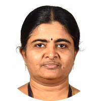
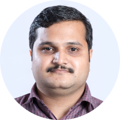
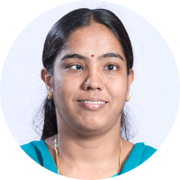

# My Gurus

## School - St. Joseph Nursery School, Mettupalayam

### Class Teachers

| S.No. | Standard | Name | 
|:-----:|:--------:|:------|
|   1   | LKG      |        | 
|   2   | UKG      |        |

## School - San Jose Matriculation Higher Secondary School, Mettupalayam

### Class Teachers

| S.No. | Standard | Name | 
|:-----:|:--------:|:------|
|   1   |    I     | Sudha Miss (Ms. Sudha) | 
|   2   |    II    | Andeepthi Sister (Sr. Andeepthi) | 
|   3   |    III   | Annie Miss (Ms. Annie) | 
|   4   |    IV    | Leena Miss (Ms. Leena) |
|   5   |    V     | Rabiya Miss (Ms. Rabiya) | 
|   6   |    VI    | Charanya  Miss (Ms. Charanya) | 
|   7   |    VI    | ஆசிரியை [இராஜசுலோச்சனா] (Ms. Rajasulochana) | 
|   8   |    VII   | Lathika  Miss (Ms. Lathika) | 
|   9   |    VIII  | Premakumari Miss (Ms. Premakumari) | 
|   10  |    IX    | Madhumathi  Miss (Ms. Madhumathi) | 
|   11  |    X     | Lathika Miss (Ms. Lathika) | 
|   12  |    XI    | ஆசிரியை [இராஜசுலோச்சனா] (Ms. Rajasulochana) | 
|   13  |    XII   | Agna Sister (Sr. Agna Geogre) | 

### Subject Teachers

| S.No. | Standard | Name | Subject |
|:-----:|:--------:|:----|---------|
|   1  |          | Balu Sir (Mr. Balu) | Physical Education |
|   2  |          | Jaya Raj Sir (Mr. Jaya Raj) | Physical Education |
|   3  |          | Tamil Suganya Miss (Ms. Suganya) | தமிழ் |
|   4  |  XI - X, XII  | ஆசிரியை [இராஜசுலோச்சனா] (Ms. Rajasulochana) | தமிழ் |
|   5  |   XI    | அய்யா [பன்னீர்செல்வம்] (Mr. Pannerselvam) | தமிழ் |
|   6  |  VII - IX  | Madhumathi  Miss (Ms. Madhumathi) | English |
|   7  |  XI - XII  | Premakala Miss (Ms. Premakala) | English |
|   8  |   X      | Beena Miss (Ms. Beena) | Mathematics |
|   9  |   IX  | Premakumari Miss (Ms. Premakumari) | Mathematics |
|   10  |  XI - XII | Miss () | Mathematics | 
|   11  |          | Sajitha Miss (Ms. Sajitha) | Physical Science |
|   12  |  X - XII | Lathika Miss (Ms. Lathika) | Physical Science |
|   13  |    XII   | Moorthy Sir (Mr. Moorthy) | Chemistry |
|   14  |    VIII  | Alphonsa Miss (Ms. Alphonsa) | Biology |
|   15  |   IX    | Andeepthi Sister (Sr. Andeepthi) | Biology |
|   16  |   IX - X | Agna Sister (Sr. Agna George) | Biology |
|   17  |    IX    | Elangovan Sir (Mr. Elangovan) | History |
|   18  |          | Chandra Jaganathan Miss (Ms. Chandra Jaganathan) | Geography |
|   19  |    X     | Selina Sister (Sr. Celina) |  Geography |
|   20  |          | Library Suganya Miss (Ms. Suganya) | Computer Science |
|   21  |    XI    | Nithya Miss (Ms. Nithya) | Computer Science |
|   22  |    XII   | Praveena Miss (Ms. Praveena) | Computer Science |
|   23  |          | Library Suganya Miss (Ms. Suganya) | Library |
|   24  |    XI - XII   | Nair Sir (Mr. Somasekharan Nair) | Communication Skills |

## CSC Computer Education, Mettupalayam

| S.No. | Name | Course |
|:-----:|:----:|---------|
|   1   | Mr. Inayathulla | HDCA |

## Tuition, Mettupalayam

| S.No. | Standard | Name | Subject(s) |
|:-----:|:--------:|:------|---------|
|   1   |   V     | Kalaiselvi Akka (Ms. Kalaiselvi) | All |
|   2   |   VI    | Geetha Akka ( Ms. Geetha) | All |
|   3   |  VII - IX | Nirmala Akka (Ms. Nirmala) | All |
|   4   | IX, XI - XII | Suganya Akka (Ms. Suganya) | Mathematics |
|   5   | X | Udhaya Akka (Ms. Udhayaveni) | All |
|   6   | XI - XII | Velusamy Sir (Mr. Velusamy)  | Physics |
|   7   | XI - XII | Nandhakumar Sir (Mr. Nandhakumar) | Chemistry |
|   8   | XI - XII | Rajasingh Sir (Mr. Rajasingh) | Mathematics |
|   9   | XI - XII | Nair Sir (Mr. Somasekharan Nair)  | **Everything** |

## College 

### UG - Kumaraguru College of Technology, Coimbatore - B.Tech (Information Technology)

  

#### I Semester 

| S.No. |  Name | Subject |
|:-----:|:-------:|---------|
|   1   |    Ms. Gnanambal Illango | Mathematics - I |
|   2   | Ms. Vidyavathi | English- I |
|   3   |    Mr. R. Balamurugan | Physics - I | 
|   4   | Mr. Sivahari | Chemistry - I |
|   5   | Mr. Palanisamy | Engineering Graphics |
|   6   |    Mr. K.R. Baskaran | Fundamentals of Computing (FOC) |

#### II Semester

| S.No. |  Name | Subject |
|:-----:|:-------:|---------|
|   1   |    Mr. R. Krishna Moorthy | Mathematics - II |
|   2   | Ms. Diana Lawrence | English - II |
|   3   |    Mr. R. Balamurugan | Physics - II |
|   4   | Ms. Latha | Electrical and Electronics Circuits |
|   5   | Ms. N. Chitra Devi | Data Structures |
|   6   | Mr. Sivashakthivel | Engineering Mechanics |

#### III Semester

| S.No. |  Name | Subject |
|:-----:|:-------:|---------|
|   1   | Ms. Uma |  Mathematics - III |
|   2   |    Ms. K. Thilagavathi |  Principles of Communication (POC) |
|   3   |    Ms. N. Suganthi | Microprocessors |
|   4   |    Ms. S. Kavitha | Object Oriented Programming and C++ |
|   5   |    Ms. S. Sathyavathi | Digital Principle and System Design |
|   6   |    Mr. K.R. Baskaran | Computer Architecture |

#### IV Semester

| S.No. |  Name | Subject |
|:-----:|:-------:|---------|
|   1   |    Ms. S. Sivasakthi | Probability and Applied Statistics |
|   2   |	   Mr. R. Mayildurai | Environmental Science and Engineering |
|   3   |    Mr. K.R. Baskaran | System Software |
|   4   |    Ms. S. Sathyavathi | Software Engineering |
|   5   |    Mr. E.A. Vimal | Internet and Java Programming |
|   6   | Dr. L. Jayashree | Computer Networks |
 
#### V Semester

| S.No. |  Name | Subject |
|:-----:|:-------:|---------|
|   1   | Mr. Jaishankar | Digital Signal Processing (DSP) |
|   2   |	   Ms. N. Suganthi | Telecommunication Systems |
|   3   | Ms. N. Chitra Devi | Object Oriented Analysis and Design (OOAD) |
|   4   |    Ms. J. Cynthia | TCP/IP and Socket Programming |
|   5   |    Mr. V. Vijilesh | Principles of Compiler Design |
|   6   |    Mr. K.R. Baskaran | Operating Systems |
 
#### VI Semester

| S.No. |  Name | Subject |
|:-----:|:-------:|---------|
|   1   |    Ms. A. Santha | Numerical Methods |
|   2   |	   Ms. S. Kavitha | Database Management Systems (DBMS) |
|   3   |    Mr. K.M. Senthil Kumar | Professional Ethics and Human Values |
|   4   | Dr. L. Jayashree | High Performance Networks (HPN) |
|   5   |    Mr. S. Kanagaraj | Visual Programming |
|   6   |    Ms. N. Suganthi | Cryptography and Network Security |
 
#### VII Semester

| S.No. |  Name | Subject |
|:-----:|:-------:|---------|
|   1   | Mr. Dinesh | User Interface Design (UID) |
|   2   |	   Ms. P. Shenbagam | Graphics and Multimedia |
|   3   | Dr. L. Jayashree | Mobile Computing |
|   4   | Ms. Vijayakumari | Mathematics |
|   5   |    Ms. S. Sathyavathi | Principles of Management (POM) |
|   6   |    Mr. E.A. Vimal | Component Based Technology (CBT) |
|   7   |    Ms. N. Rajathi | Advanced Java Programming |

#### VIII Semester

| S.No. |  Name | Subject |
|:-----:|:-------:|---------|
|   1   | Ms. N. Chitra Devi | Management Information System (MIS) |
|   2   |	Ms. Latha | Information Security (IS) |
|   3   |    Mr. E.A. Vimal | XML and Web Services |
|   4   |    Mr. K.M. Senthil Kumar | Total Quality Management (TQM) |
|   5   |    Ms. N. Suganthi | Project |

#### Clubs

| S.No. |  Name | Club |
|:-----:|:-------:|---------|
|   1   |    Mr. K. Kumaresan | Nature Club |

### Robert Bosch Engineering and Business Solutions Private Ltd - Coimbatore

| S.No. |  Name | Subject |
|:-----:|:-------:|---------|
|   1   |    Mr. Parish Sharma | FOCAS Training - Software Testing |
|   2   |    Mr. Muthukrishnan Kamalakannan | Test Automation |

### PG - Amrita School of Engineering, Coimbatore - M.Tech (Cyber Security)

  

#### I Semester 

| S.No. |  Name | Subject |
|:-----:|:-------:|---------|
|   1   |    Dr. M. Sindhu | Mathematical Foundations for Cyber Security |
|   2   |	   Mr. K. Praveen | Concepts in System Security (CSS) |
|   3   |    Prof. M. Sethumadhavan | Cryptography |
|   4   |    Prof. K. Gangadharan | Internetworking - Protocols and Security |
|   5   |    Dr. T. Gireesh Kumar | Data Mining and Machine Learning in Cyber Security (DMML-CS) |
|   6   |    Prof. C.S. Udhayakumar | Cultural Education |

#### II Semester

| S.No. |  Name | Subject |
|:-----:|:-------:|---------|
|   1   |    Mr. Ashok Kumar Mohan | Cyber Forensics |
|   2   |	   Dr. K.V. Lakshmy | Cryptographic Protocols and Standards |
|   3   |    Ms. K.P. Jevitha | Secure Coding |
|   4   |    Prof. K. Gangadharan | Mobile & Wireless Networking and Security |
|   5   |    Ms. P.P. Amritha | Steganography and Obfuscation |
|   6   |    Dr. A.R. Vasudevan | Cyber Security Lab |

#### III Semester

| S.No. |  Name | Subject |
|:-----:|:-------:|---------|
|   1   |    Dr. C. Srinivasan | Coding and Information Theory (CIT) |
|   2   |	   Mr. K. Praveen | Android Security |
|   3   |    Dr. M. Sindhu | Dissertation |

#### IV Semester

| S.No. |  Name | Subject |
|:-----:|:-------:|---------|
|   1   |    Dr. M. Sindhu        Dr. K.V. Lakshmy | Dissertation |

#### Other Sessions

| S.No. |  Name | Session |
|:-----:|:-------:|---------|
|   1   |    Prof. Prabhaker Mateti,   Wright State University | Formal Methods for System Software |

### Doctoral Research - Amrita School of Engineering, Coimbatore - Ph.D (Blockchain Technology)

#### Coursework 

| S.No. |  Name | Subject |
|:-----:|:-------:|---------|
|   1   |    Dr. Anantha Narayanan V       Ms. K. Nalinadevi        Mr. R Venkateswaran,   CTO, Persistent Systems   (ACM Expert Teacher)  | Advanced Networks |
|   2   |    Prof. M. Sethumadhavan         Prof. N. Sundararajan | Research Methodology |

#### Doctoral Committee 

| S.No. |  Name | Role |
|:-----:|:-------:|---------|
|   1   |    Prof. M. Sethumadhavan  | Thesis - Advisor |
|   2   |    Dr. K.V. Lakshmy | Thesis - Co-Advisor |
|   3   |    Dr. K.P. Jevitha | Thesis - Co-Advisor (2025 - Present) |
|   4   |    Dr. C. Srinivasan | Member |
|   5   |    Dr. K. Praveen | Member |
|   6   |    Dr. P.P. Amritha | Member (2021 - 2025) |

## Mentor - Mr. Somasekharan Nair. S
