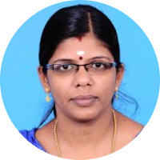

# My Gurus

## School - San Jose Matriculation Higher Secondary School, Mettupalayam

| S.No. | Standard | Name | Subject |
|:-----:|:--------:|:------:|---------|
|   1   |    I     | Sudha Miss | Class Teacher |
|   2   |    II    | Sister Andeepthi | Class Teacher, Biology |
|   3   |    III   | Annie Miss | Class Teacher |
|   4   |    IV    | Leena Miss | Class Teacher |
|   5   |    V     | Rabiya Miss | Class Teacher |
|   6   |    VI    | Charanya  Miss, Rajasulochana Miss (ராஜசுலோசனா ஆசிரியை) | Class Teacher |
|   7   |    VII   | Lathika  Miss | Class Teacher, Physics |
|   8   |    VIII  | Premakumari Miss | Class Teacher, Mathematics |
|   9   |    IX    | Madhumathi  Miss | Class Teacher, English |
|   10  |    X     | Lathika Miss | Class Teacher, Physics |
|   11  |    XI    | Rajasulochana Miss (ராஜசுலோசனா ஆசிரியை) | Class Teacher, தமிழ் |
|   12  |    XII   | Agna George Sister | Class Teacher, Biology |
|   13  |          | Balu Sir | Physical Education |
|   14  |          | Suganya Miss | தமிழ் |
|   15  |          | Suganya Miss | Computer Science, Library |
|   16  |          | Chandra Jaganathan Miss | Geography |
|   17  |          | Alphonsa Miss | Biology |
|   18  |          | Sajitha Miss | Physical Science |
|   19  |    IX    | Elangovan Sir | History |
|   20  |          | Beena Miss | Mathematics |
|   21  |          | Premakala Miss | English |
|   22  |    XI    | Pannerselvam Ayya (பன்னீர்செல்வம் அய்யா) | தமிழ் |
|   23  |    XI    | Nithya Miss | Computer Science |
|   24  |          | Jaya Raj Sir | Physical Education |
|   25  |    XII   | Praveena Miss | Computer Science |
|   26  |          | Selina Sister | Principal, Geography |

## CSC Computer Education, Mettupalayam

| S.No. | Name | Course |
|:-----:|:------:|---------|
|   1   | Mr. Inayathulla | HDCA |

## Tuition, Mettupalayam

| S.No. | Name | Subject(s) |
|:-----:|:------:|---------|
|   1   | Ms. Kalaiselvi Akka | All |
|   2   | Ms. Geetha Akka | All |
|   3   | Ms. Nirmala Akka | All |
|   4   | Ms. Suganya Akka | Mathematics |
|   5   | Ms. Udhaya Akka | All |
|   6   | Ms. Velusamy Sir  | Physics |
|   7   | Ms. Nandhakumar Sir | Chemistry |
|   8   | Ms. Rajasingh Sir | Mathematics |

## College 
### UG - Kumaraguru College of Technology, Coimbatore - B.Tech (Information Technology)

#### I Semester 

| S.No. |  Name | Subject |
|:-----:|:-------:|---------|
|   1   | Ms. Gnanambal Illango | Mathematics - I |
|   2   | Ms. Vidyavathi | English- I |
|   3   |    Mr. R. Balamurugan | Physics - I | 
|   4   | Mr. Sivahari | Chemistry - I |
|   5   | Mr. Palanisamy | Engineering Graphics |
|   6   |    Mr. K.R. Baskaran | Fundamentals of Computing (FOC) |

#### II Semester

| S.No. |  Name | Subject |
|:-----:|:-------:|---------|
|   1   |    Mr. R. Krishna Moorthy | Mathematics - II |
|   2   | Ms. Diana Lawrence | English - II |
|   3   |    Mr. R. Balamurugan | Physics - II |
|   4   | Ms. Latha | Electrical and Electronics Circuits |
|   5   | Ms. N. Chitra Devi | Data Structures |
|   6   | Mr. Sivashakthivel | Engineering Mechanics |

#### III Semester

| S.No. |  Name | Subject |
|:-----:|:-------:|---------|
|   1   | Ms. Uma |  Mathematics - III |
|   2   |    Ms. K. Thilagavathi |  Principles of Communication (POC) |
|   3   |    Mr. N. Suganthi | Microprocessors |
|   4   |    Ms. S. Kavitha | Object Oriented Programming and C++ |
|   5   |    Ms. S. Sathyavathi | Digital Principle and System Design |
|   6   |    Mr. K.R. Baskaran | Computer Architecture |

#### IV Semester

| S.No. |  Name | Subject |
|:-----:|:-------:|---------|
|   1   |    Ms. S. Sivasakthi | Probability and Applied Statistics |
|   2   |	Mr. Mayildurai | Environmental Science and Engineering |
|   3   |    Mr. K.R. Baskaran | System Software |
|   4   |    Ms. S. Sathyavathi | Software Engineering |
|   5   |    Mr. E.A. Vimal | Internet and Java Programming |
|   6   | Dr. L. Jayashree | Computer Networks |
 
#### V Semester

| S.No. |  Name | Subject |
|:-----:|:-------:|---------|
|   1   | Mr. Jaishankar | Digital Signal Processing (DSP) |
|   2   |	   Ms. N. Suganthi | Telecommunication Systems |
|   3   | Ms. N. Chitra Devi | Object Oriented Analysis and Design (OOAD) |
|   4   |    Ms. J. Cynthia | TCP/IP and Socket Programming |
|   5   |    Mr. V. Vijilesh | Principles of Compiler Design |
|   6   |    Mr. K.R. Baskaran | Operating Systems |
 
#### VI Semester

| S.No. |  Name | Subject |
|:-----:|:-------:|---------|
|   1   |    Ms. A. Santha | Numerical Methods |
|   2   |	   Ms. S. Kavitha | Database Management Systems (DBMS) |
|   3   |    Mr. K.M. Senthil Kumar | Professional Ethics and Human Values |
|   4   | Dr. L. Jayashree | High Performance Networks (HPN) |
|   5   |    Mr. S. Kanagaraj | Visual Programming |
|   6   |    Ms. N. Suganthi | Cryptography and Network Security |
 
#### VII Semester

| S.No. |  Name | Subject |
|:-----:|:-------:|---------|
|   1   | Mr. Dinesh | User Interface Design (UID) |
|   2   |	   Ms. P. Shenbagam | Graphics and Multimedia |
|   3   | Dr. L. Jayashree | Mobile Computing |
|   4   | Ms. Vijayakumari | Mathematics |
|   5   |    Ms. S. Sathyavathi | Principles of Management (POM) |
|   6   |    Mr. E.A. Vimal | Component Based Technology (CBT) |
|   7   |    Ms. N. Rajathi | Advanced Java Programming |

#### VIII Semester

| S.No. |  Name | Subject |
|:-----:|:-------:|---------|
|   1   | Ms. N. Chitra Devi | Management Information System (MIS) |
|   2   |	Ms. Latha | Information Security (IS) |
|   3   |    Mr. E.A. Vimal | XML and Web Services |
|   4   |    Mr. Senthil Kumar | Total Quality Management (TQM) |
|   5   |    Ms. N. Suganthi | Project |

#### Clubs

| S.No. |  Name | Club |
|:-----:|:-------:|---------|
|   1   |    Mr. K. Kumaresan | Nature Club |

### Robert Bosch Engineering and Business Solutions Private Ltd - Coimbatore

| S.No. |  Name | Subject |
|:-----:|:-------:|---------|
|   1   | Mr. Parish Sharma | FOCAS Training - Software Testing |
|   2   | Mr. Muthukrishnan Kamalakannan | Test Automation |

### PG - Amrita School of Engineering, Coimbatore - M.Tech (Cyber Security)

#### I Semester 

| S.No. |  Name | Subject |
|:-----:|:-------:|---------|
|   1   |    Dr. M. Sindhu | Mathematical Foundations for Cyber Security |
|   2   |	   Mr. K. Praveen | Concepts in System Security (CSS) |
|   3   |    Prof. M. Sethumadhavan | Cryptography |
|   4   | Prof. K. Gangadharan | Internetworking - Protocols and Security |
|   5   | Dr. T. Gireesh Kumar | Data Mining and Machine Learning in Cyber Security (DMML-CS) |
|   6   | Mr. Udhyakumar | Cultural Education |

#### II Semester

| S.No. |  Name | Subject |
|:-----:|:-------:|---------|
|   1   |    Mr. Ashok Kumar Mohan | Cyber Forensics |
|   2   |	   Dr. K.V. Lakshmy | Cryptographic Protocols and Standards |
|   3   | Ms. K.P. Jeevitha | Secure Coding |
|   4   | Prof. K. Gangadharan | Mobile & Wireless Networking and Security |
|   5   |    Ms. P.P. Amritha | Steganography and Obfuscation |
|   6   | Dr. A.R. Vasudevan | Cyber Security Lab |

#### III Semester

| S.No. |  Name | Subject |
|:-----:|:-------:|---------|
|   1   |    Dr. C. Srinivasan | Coding and Information Theory (CIT) |
|   2   |	   Mr. K. Praveen | Android Security |
|   3   |    Dr. M. Sindhu | Dissertation |

#### IV Semester

| S.No. |  Name | Subject |
|:-----:|:-------:|---------|
|   1   |    Dr. M. Sindhu      Dr. K.V. Lakshmy | Dissertation |

#### Other Sessions

| S.No. |  Name | Session |
|:-----:|:-------:|---------|
|   1   |    Prof. Prabhaker Mateti | Formal Methods for System Software |

### Doctoral Research - Amrita School of Engineering, Coimbatore - Ph.D (Blockchain Technology)

#### Coursework 

| S.No. |  Name | Subject |
|:-----:|:-------:|---------|
|   1   |    Dr. Anantha Narayanan V   Prof. K. Nalinadevi  | Advanced Networks |
|   2   |    Prof. M. Sethumadhavan   Prof. N. Sundararajan | Research Methodology |

## Mentor - Somasekharan Nair. S
